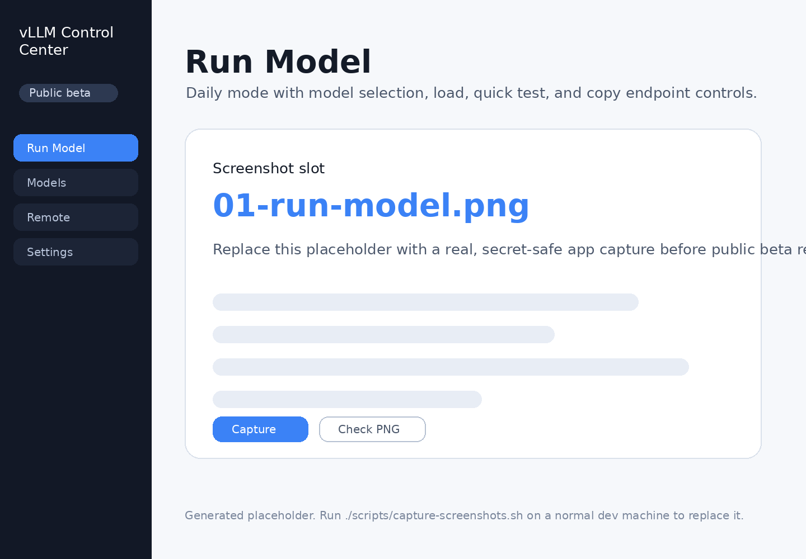
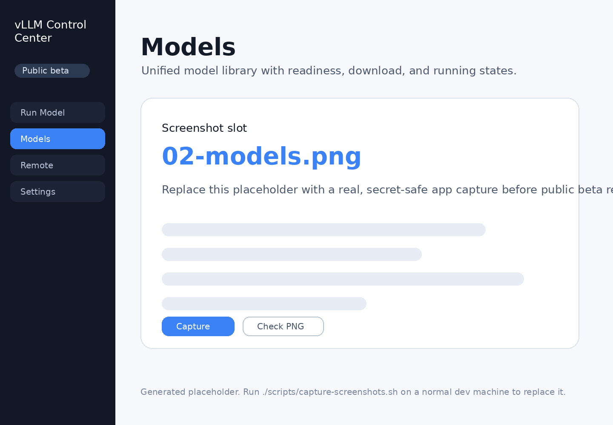
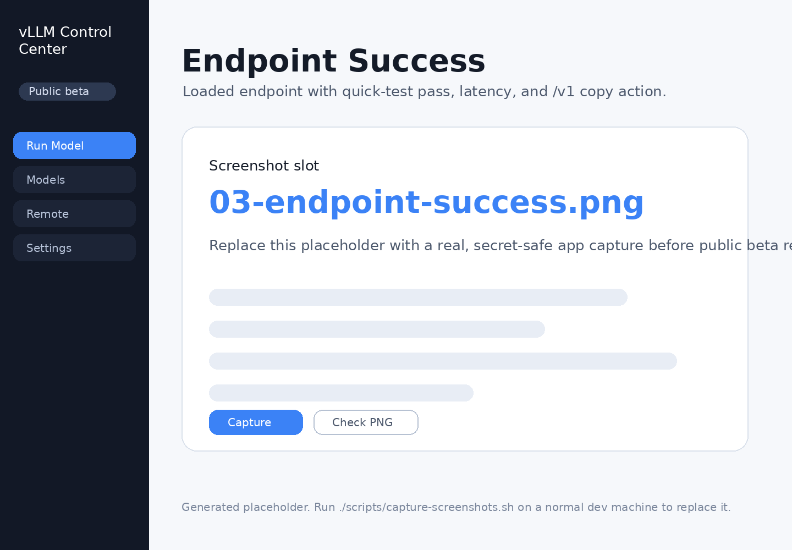
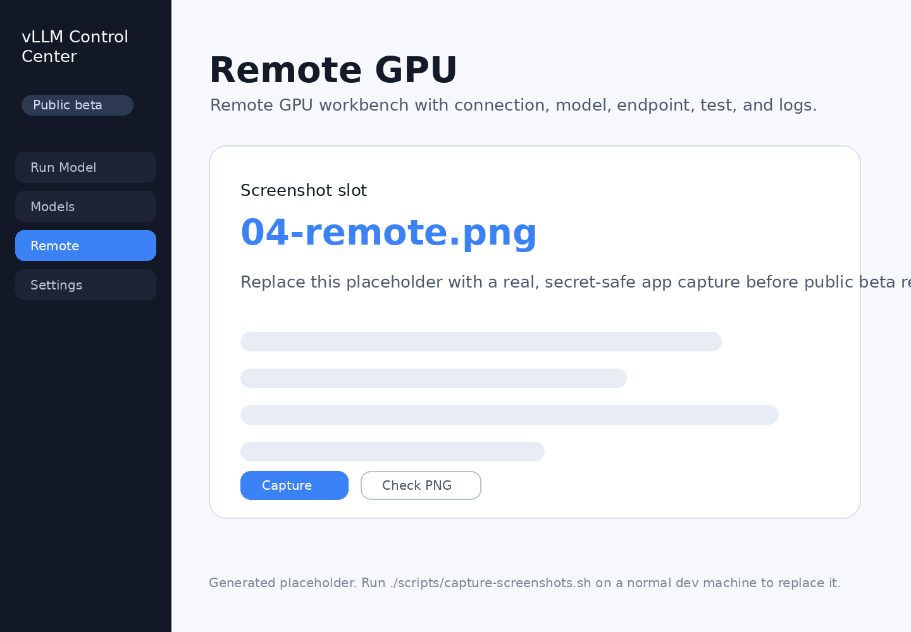
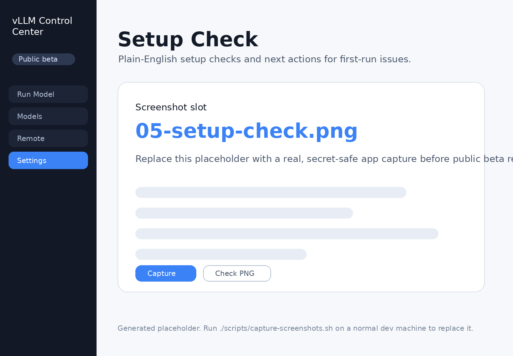

# vLLM Control Center

**Current release: v0.62 GitHub Public Repo Cleanup Pass**

vLLM Control Center is an open-source, LM Studio-style control plane for vLLM. It focuses on one daily workflow:

```text
choose model -> load -> quick test -> copy OpenAI-compatible /v1 endpoint
```

It is not a generic chat UI and it is not an inference engine. vLLM stays the runtime; this app provides the easier local and remote GPU control layer around it.


## Beta status

This repository is ready for public beta source release. The supported path is web-first:

- **Works now:** local controller, browser UI, model discovery/downloads, start/stop, direct test panel after load, Playground fallback tests, endpoint handoff, remote GPU control surfaces, and release/audit checks.
- **Still beta:** real vLLM behavior depends on the user's GPU, Python environment, model format, quantization, and installed vLLM version. Some local/remote happy paths still need manual verification on a vLLM-capable machine.
- **Not promised yet:** signed desktop installers, auto-update, desktop-managed controller lifecycle, and a production Electron app. Electron remains preview-only.

## What it does

- Detects models already on this device
- Shows a unified local model library
- Groups model variants and quantizations
- Downloads Hugging Face models from the app
- Loads and unloads models with safer presets
- Runs a quick endpoint test
- Copies OpenAI-compatible endpoint details and SDK snippets
- Controls remote GPU machines from the same UI
- Keeps advanced logs, metrics, diagnostics, release checks, and operator tools behind Advanced mode

## Product shape

The public beta has two modes:

**Daily mode**
- Run Model
- Models
- Remote
- Settings

**Advanced mode**
- Setup check
- Logs
- Metrics
- Playground
- Release kit
- Compatibility/debug/operator tools

Daily mode should stay calm and close to LM Studio: select a model, load it, test it, copy the endpoint.

## Quick start

### 1. Install beta dependencies

```bash
./scripts/bootstrap.sh
```

This creates the controller virtualenv, installs backend dependencies, and installs frontend packages.

### 2. Start the app

```bash
./scripts/dev.sh
```

Open the Vite URL in your browser. The UI talks to the local FastAPI controller at `http://127.0.0.1:8787`.

If the app does not open or the frontend cannot reach the backend, run:

```bash
./scripts/launch-check.sh
```

### 3. Run the happy path

1. Open **Run Model**
2. Use a detected model or download a starter model
3. Click **Start** and wait for the endpoint readiness check
4. Run **Quick test**
5. Copy the `/v1` endpoint or SDK snippet


## Public beta release packet

For release-facing copy and tester intake, see:

- `docs/releases/PUBLIC_BETA_RELEASE_NOTES.md` — draft GitHub release body and tester instructions
- `docs/releases/KNOWN_LIMITATIONS.md` — honest beta limitations
- `docs/releases/ISSUE_INTAKE.md` — maintainer triage guide and blocker rubric

## Milestone plan

The beta path is tracked in `docs/MILESTONES.md`. The short version:

- **v0.25** was the first public beta tag after the archived internal release-candidate track.
- **v0.26** opened the beta feedback fix lane.
- **v0.28** reduced model-library noise.
- **v0.29** clarified `/v1` base URL and quick-test wording.
- **v0.30** responds to real Run Model feedback: safer text wrapping, LM Studio-style Start/Test/Copy language, and automatic detection for LM Studio, Hugging Face, vLLM, Unsloth, Downloads, and common model folders.
- **v0.33** validates the real vLLM happy path by keeping instances in warming-up state until `/v1/models` or `/health` responds.
- **v0.34** keeps Start/result copy honest and remembers recent local-model crash reasons so retryable failures are visible without cluttering the main path.
- **v0.35** tightens Remote so the selected model controls the copied `/v1` endpoint and stopped/wrong endpoints are not handed off as ready.
- **v0.36** adds a Low VRAM retry path for crashed local loads so users can retry with safer settings instead of guessing at vLLM flags.
- **v0.37** keeps local endpoint handoff honest by unlocking copy/snippets only after Quick test passes for the selected running model.
- **v0.38** closes the same test-before-copy gate in the model detail drawer, so every local copy action now waits for the selected running model to pass Quick test.
- **v0.39** applies the same confidence rule to Remote: selected remote endpoints stay visible, but Copy unlocks only after the selected remote model passes Quick test.
- **v0.42** added Quick test failure guidance for local and remote endpoint tests.
- **v0.43** extends that guidance into streaming playground failures, so token-stream errors show a readable reason and next actions too.
- **v0.44** adds served-model-name mismatch guidance: if vLLM is alive but the request uses the wrong model name, Quick test can show the actual served name from `/v1/models`.
- **v0.46** adds auto served-name retry: when Quick test detects a served-model-name mismatch, it retries once with the actual `/v1/models` name and unlocks Copy only if that exact retry passes.
- **v0.49** adds a tested `.env` handoff after Quick test passes, so users can copy `OPENAI_BASE_URL` and the exact tested `OPENAI_MODEL` for real apps without stale values.
- **v0.50** makes that `.env` handoff safer by quoting unusual endpoint/model values and labeling it as generated from a passed Quick test.
- **v0.51** makes handoff copy more reliable in preview shells, insecure origins, and older browsers by falling back when the Clipboard API is blocked.
- **v0.52** shows a selectable manual-copy panel if browser clipboard access is still blocked after fallback, so users are not stranded.
- **v0.53** adds an explicit Select all action and character count to that manual-copy fallback, making blocked clipboard states safer on phones, WebViews, and preview shells.
- **v0.54** adds a lightweight copy-success confirmation for local and remote handoff actions, showing what was copied, a short preview, and the character count; it clears when the selected run or load profile changes.
- **v0.55** polishes long model IDs, served model names, snapshot filenames, and local paths so the main Run Model, Models, Downloads, and Remote rows stay readable while full values remain in details.
- **v0.56** syncs the visible sidebar beta badge from package metadata so testers see the current release instead of stale labels such as old historical beta labels.
- **v0.57** makes Playground list the actually loaded/warming local model, preserve handoff selection, and avoid indefinite streaming waits.
- **v0.58** makes Playground retry once with the actual `/v1/models` served name when vLLM reports a served-model-name mismatch.
- **v0.59** makes Playground connect through localhost when vLLM is bound to a wildcard host such as `0.0.0.0`, so a loaded local model is not shown as reachable but then tested through an unreliable wildcard URL.
- **v0.60** adds a Stop test control plus first-token and inactivity timeouts, so Playground no longer sits forever on “Waiting for first token…” when a loaded model stalls.
- **v0.61** adds a direct Test this model panel after load, with an editable prompt, starter prompt chips, and a chat-like response so testing is obvious without hunting for Playground.
- **v0.62** cleans the repo for first GitHub publication by archiving old internal history, trimming public agent prompts, adding a GitHub release checklist, and keeping public docs focused on the current beta path.
- **v1.0** waits until fresh install, model load, quick test, and `/v1` endpoint handoff are reliable for real users.

After v0.25, the priority stays clarity and reliability over more UI.

## Public beta demo path

Use this path for screenshots, short videos, and first-user walkthroughs:

1. Start from a fresh browser session in **Daily mode**.
2. Open **Run Model** and show the calm first-launch state.
3. Select a detected model or download a starter model.
4. Start the model with the default preset and show the warming-up state.
5. Run **Quick test** and show the pass/latency result.
6. Open **Use this endpoint in your app** and copy the `/v1` endpoint or SDK snippet.
7. Optionally open **Remote** to show either the clean empty state or one connected GPU.

## Beta screenshot gallery

These images are wired for the public beta README and release page. The packaged files are secret-safe placeholder cards so README links are never broken; replace them with real captures by running `./scripts/capture-screenshots.sh`, then run `./scripts/check-screenshots.sh`.

| Screenshot | What it shows |
| --- | --- |
|  | Run a vLLM model from one calm daily screen. |
|  | Local models and downloads in one simple library. |
|  | Confirm the model responds, then copy the OpenAI-compatible endpoint. |
|  | Manage a remote GPU without turning the app into an ops dashboard. |
|  | Plain-English setup checks for first-run problems. |

### Screenshot capture contract

Place final screenshots in `docs/screenshots/` using these names:

| File | What it should show |
| --- | --- |
| `01-run-model.png` | Daily mode with selected model, load/test/copy controls |
| `02-models.png` | Unified model library with clear ready/running/downloading status |
| `03-endpoint-success.png` | Loaded endpoint, Quick test pass, and copy `/v1` action |
| `04-remote.png` | Remote GPU workbench or clean remote empty state |
| `05-setup-check.png` | Plain-English setup checks and next actions |

Screenshot rule: no private paths, private endpoints, API keys, tokens, customer names, or real cloud hostnames. Use demo data from `docs/demo/beta-demo-data.md` when possible.

## Check and package

```bash
./scripts/version-scheme-check.sh
./scripts/launch-check.sh
./scripts/smoke.sh
./scripts/check-screenshots.sh
./scripts/bug-bash-check.sh
./scripts/release-freeze-check.sh
./scripts/check.sh
zip -r vllm-control-center-starter-v0.62.zip . \
  -x '*/node_modules/*' '*/dist/*' '*/__pycache__/*' \
  -x '*/.pytest_cache/*' '*/.ruff_cache/*' '*.db' '*.sqlite'
```


## Beta bug-bash status

For the v0.62 GitHub Public Repo Cleanup beta pass, track blocker status in:

- `docs/releases/BETA_BUG_BASH_STATUS.md` — single ledger for beta blockers, beta polish, post-beta work, and not-planned items
- `docs/releases/BETA_FEEDBACK_FIX_LANE.md` — what v0.x beta fixes are allowed to change and what must wait

Run the beta blocker and release-freeze checks with:

```bash
./scripts/bug-bash-check.sh
./scripts/release-freeze-check.sh
```

## Beta bug bash

Before asking real users to try the app, run:

```bash
./scripts/version-scheme-check.sh
./scripts/launch-check.sh
./scripts/smoke.sh
./scripts/check-screenshots.sh
./scripts/bug-bash-check.sh
./scripts/release-freeze-check.sh
./scripts/check.sh
```

Then follow `docs/BETA_BUG_BASH.md` to verify the fresh install path, local model detection, load/test/copy endpoint flow, failure recovery, and Remote empty/connected states.

## Included surfaces

### Core UI

- **Run Model** — daily workbench for model selection, load/unload, quick test, endpoint copy, and developer handoff
- **Models** — unified library for local models, downloads, compatibility hints, and recovery actions
- **Remote** — simplified remote GPU workbench for connection, running model, endpoint, quick test, and logs
- **Settings** — compact local controller settings and security status

### Support and advanced tools

- Setup check
- Logs
- Metrics
- Playground
- Release kit
- Hugging Face catalog
- Compatibility advisor
- Remote profiles and remote instances
- Exports and recipes

These remain available, but should not crowd the default daily path.

## Backend

- FastAPI controller
- Safe vLLM command compiler
- Local process manager for `vllm serve`
- SQLite persistence
- SSE log streaming
- GPU status via `nvidia-smi`
- Hugging Face download queue
- Plain-English recovery advice for common vLLM/download failures
- Local model scanner with compatibility hints for Safetensors, PyTorch `.bin`, GGUF, AWQ, GPTQ, dtype hints, tokenizer/config presence, context length, and HF shards
- Remote controller/profile bridge

## Frontend

- React + Vite
- Daily / Advanced mode boundary
- LM Studio-style Run Model flow
- Unified Models library
- Remote GPU command center
- Model detail drawer
- Quick test result state
- Endpoint copy and SDK snippets
- Compact first-launch onboarding


## Desktop packaging decision

v0.62 beta feedback lane is **web-first**. The Electron shell remains a preview for maintainers and early testers, not a production installer.

Supported for beta:

- browser UI started with `./scripts/dev.sh`
- local FastAPI controller at `http://127.0.0.1:8787`
- launch/smoke/screenshot checks

Preview only:

- `desktop/electron`
- local Electron development shell

Not promised in v0.62:

- signed macOS, Windows, or Linux installers
- auto-update
- desktop-managed controller lifecycle
- production desktop support guarantees

See `docs/releases/DESKTOP_PACKAGING_DECISION.md` for the full decision.

## Desktop shell spike

An Electron prototype lives in `desktop/electron`. It wraps the existing web frontend and keeps the FastAPI controller as the source of truth. It is still a spike, not a production installer.

## Open source readiness

- MIT license
- Code of Conduct
- Contributing guide
- Security policy
- Public roadmap
- Bug/feature templates
- Pull request template

## Public beta rule

From the public beta line onward, avoid adding new visible daily-mode cards unless they replace or remove an existing surface. The product should get simpler, not wider.

For beta validation, run `./scripts/version-scheme-check.sh`, then `./scripts/launch-check.sh`, then `./scripts/smoke.sh`, then `./scripts/check.sh`. Use `docs/BETA_BUG_BASH.md` for the manual first-run and endpoint-success checklist.


## Version numbering

Public releases now use pre-1.0 semantic-style tags. Earlier internal packages were release-candidate iterations and are archived; the public beta starts at **v0.25**. Future beta versions should continue as **v0.26**, **v0.27**, **v0.28**, **v0.29**, **v0.30**, **v0.31**, **v0.32**, **v0.33**, **v0.34**, **v0.35**, **v0.36**, **v0.37**, **v0.38**, **v0.39**, **v0.40**, **v0.41**, **v0.42**, **v0.43**, **v0.44**, **v0.45**, **v0.46**, **v0.47**, **v0.48**, **v0.49**, **v0.50**, **v0.51**, **v0.52**, **v0.53**, **v0.54**, **v0.55**, **v0.56**, **v0.57**, **v0.58**, **v0.59**, **v0.60**, **v0.61**, **v0.62**, and so on. Do not return to v25.0/v26.x numbering unless the project intentionally changes its release scheme again. See `docs/VERSION_NUMBER_CHANGE_BRIEF.md`.
