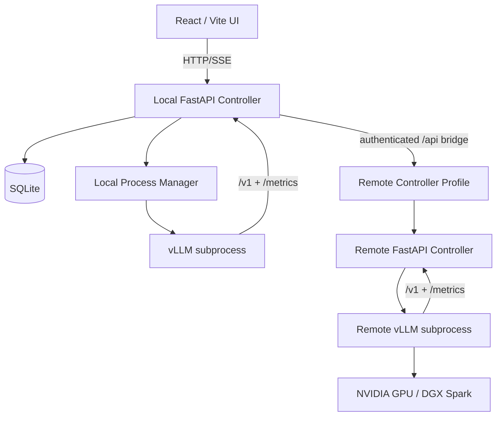

# Architecture Diagram

vLLM Control Center is a controller-first app. The frontend never starts vLLM directly. It talks to a local controller, and that controller can either manage local instances or bridge to a remote controller profile.

## Design principles

1. **Controller-first**: UI code should stay simple and should not know how to spawn processes.
2. **No shell execution**: subprocesses are started with argv arrays.
3. **Reproducible configs**: every UI launch should be exportable as CLI/YAML/Docker/Compose.
4. **Remote is first-class**: local and remote workflows should feel similar from the UI.
5. **Observability is product UX**: logs, metrics, and errors are not debug afterthoughts; they are core UI.

## Local components

- `frontend/`: React/Vite shell.
- `controller/app/api`: HTTP routes.
- `controller/app/core`: process, metrics, command, and remote bridge logic.
- `controller/app/schemas`: Pydantic contracts.
- `controller/app/db.py`: SQLite schema and connection helper.

## Remote components

A remote GPU machine runs the same controller. The local controller stores a remote profile with base URL and optional API key, then forwards limited `/api/...` requests. It is not a generic URL proxy.

## Trust boundaries

- Browser to local controller: local development trust boundary.
- Local controller to remote controller: authenticated remote bridge.
- Controller to vLLM process: controlled subprocess started by the app.
- Exported commands/configs: secrets must be redacted by default.
